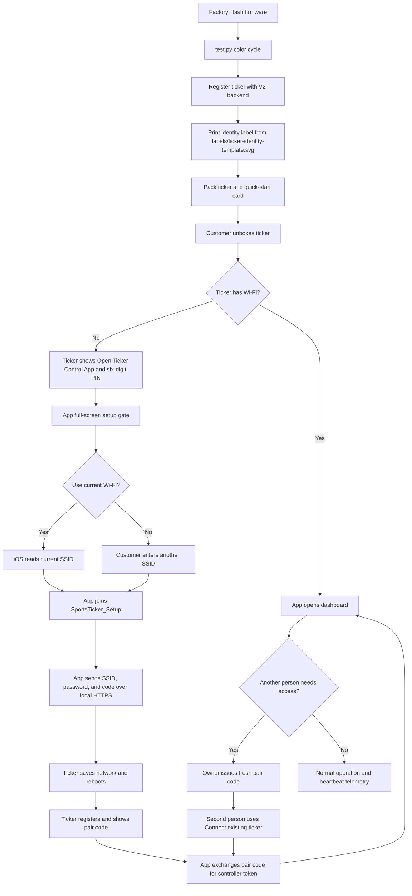

# Ticker setup process

This diagram covers factory testing, shipment, customer setup, and a second controller joining an existing ticker.

## Security boundaries

- The six-digit code gates the temporary setup session. The app derives the hotspot password internally, so the ticker does not display it.
- The setup session expires after 15 minutes and limits failed submissions.
- Pair codes expire after 10 minutes and become single-use controller tokens.
- The permanent label contains identity fields only. It does not contain the temporary Wi-Fi password.
- The local setup portal runs over HTTPS on the temporary ticker hotspot. The ticker creates a short-lived certificate for the setup session.
- Production backend traffic uses TLS and deployment-authorized fleet health access.

Run `python test.py --sink hardware --report C:\ticker\diagnostic.json` before shipment. Run the hotspot option only during controlled bench testing.
