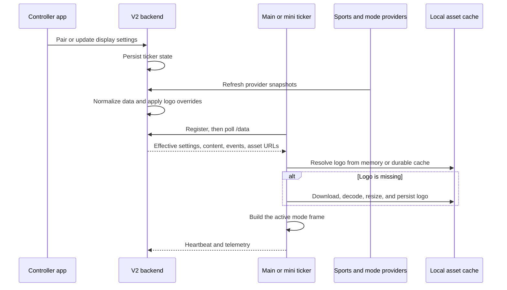

# Sports ticker system flow

The app controls durable ticker settings. The backend owns provider data, pairing, projections, and fleet state. The main ticker and mini ticker poll the same V2 contract and render locally.

```mermaid
flowchart LR
    APP["TickerControlApp\nContentView.swift"]
    API["V2 Flask API\nsports_ticker/api/routes.py"]
    APPDATA["Pairing, mode, team,\nlayout, and display settings"]
    PAIR["Pairing exchange\n/api/v2/pairings/exchange"]
    REG["Device registration\n/api/v2/devices/register"]
    DATA["Ticker projection\n/api/v2/tickers/{id}/data"]
    HEART["Heartbeat, updates,\nreboot acknowledgements"]
    REPO["Fleet repository\nsports_ticker/fleet/repository.py"]
    STATE["Durable ticker state\nsettings, pairing, tokens, events"]
    SCHED["Refresh scheduler\nsports_ticker/application/scheduler.py"]
    PROVIDERS["Providers\nESPN, racing, golf, weather, stocks,\nmusic, flights, news, alerts"]
    NORM["Normalization and shared display projection\nproviders/normalization.py\nprojections/data_api.py"]
    EVENTS["Overlay events\nnews, score alerts, updates"]
    MAIN["Main ticker\nticker_core"]
    MINIFW["Mini ticker firmware\nesp32_hub75/src/main.cpp"]
    MAINPOLL["V2 polling client\nprotocol/client.py + polling.py"]
    MINIPOLL["Wi-Fi polling and registration\nfetchData(), registerDevice(), sendHeartbeat()"]
    MAINSTATE["Runtime state and pacing\nruntime/* + app/application.py"]
    MINISTATE["Local payload and mode state\nWi-Fi, pairing, page rotation"]
    MAINASSET["Asset planner and durable cache\nassets/planner.py + platform/assets.py"]
    MINIASSET["Two-stage logo loading\n4 foreground, remaining background"]
    MAINRENDER["Feature renderers\nsports, racing, golf, weather, music,\nflights, clock, alerts"]
    MINIRENDER["64x32 HUB75 renderer\nRGB565 logos and sports panels"]
    MAINOUT["Main display\n384x32 frame"]
    MINIWORKER["Core 0 logo worker\nRAM cache + LittleFS cache"]
    MINIIO["Core 1 display loop\nnetwork state + rendering"]
    MINIout["Mini display\n64x32 frame"]

    APP --> APPDATA
    APPDATA --> API
    APP --> PAIR
    PAIR --> API
    API --> REPO
    REPO --> STATE
    API --> REG
    REG --> REPO
    API --> DATA
    API --> HEART
    HEART --> REPO
    STATE --> DATA
    SCHED --> PROVIDERS
    PROVIDERS --> NORM
    NORM --> DATA
    EVENTS --> DATA

    DATA --> MAINPOLL
    DATA --> MINIPOLL
    MAINPOLL --> MAINSTATE
    MINIPOLL --> MINISTATE
    MAINSTATE --> MAINASSET
    MAINSTATE --> MAINRENDER
    MAINASSET --> MAINRENDER
    MAINRENDER --> MAINOUT
    MINISTATE --> MINIASSET
    MINIASSET --> MINIWORKER
    MINIASSET --> MINIIO
    MINIWORKER --> MINIIO
    MINIIO --> MINIRENDER
    MINIRENDER --> MINIout

    MAINPOLL -. heartbeat and telemetry .-> HEART
    MINIPOLL -. heartbeat and telemetry .-> HEART
    APP -. settings changes .-> API

    classDef control fill:#e9d5ff,stroke:#7e22ce,color:#111827;
    classDef backend fill:#dbeafe,stroke:#2563eb,color:#111827;
    classDef ticker fill:#dcfce7,stroke:#16a34a,color:#111827;
    classDef cache fill:#fef3c7,stroke:#d97706,color:#111827;
    class APP,APPDATA,PAIR control;
    class API,REG,DATA,HEART,REPO,STATE,SCHED,PROVIDERS,NORM,EVENTS backend;
    class MAIN,MAINPOLL,MAINSTATE,MAINRENDER,MAINOUT,MINIFW,MINIPOLL,MINISTATE,MINIRENDER,MINIIO,MINIout ticker;
    class MAINASSET,MINIASSET,MINIWORKER cache;
```

## Runtime sequence

## Ownership boundaries

- The app owns user actions and controller credentials.
- The backend owns durable state, provider refreshes, normalized display facts, pairing, events, and fleet telemetry.
- The main ticker owns runtime pacing, feature rendering, and its durable asset cache.
- The mini ticker owns its Wi-Fi state machine, 64x32 rendering, local logo overrides, and two-level logo cache.
- Both devices consume the same V2 data contract. They do not share a display loop or fetch provider data directly.
